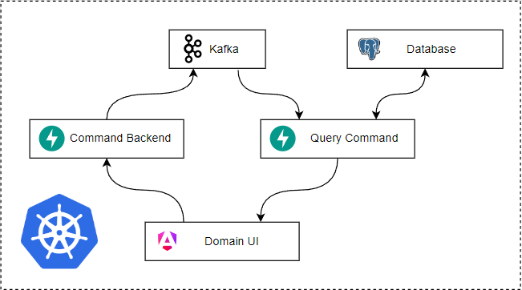
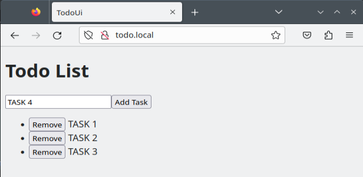
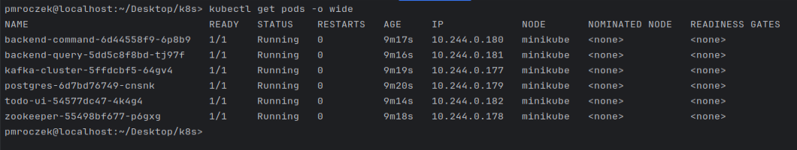
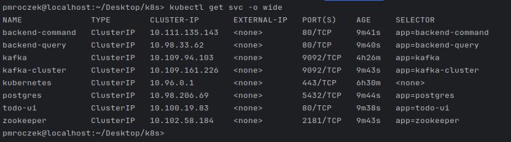
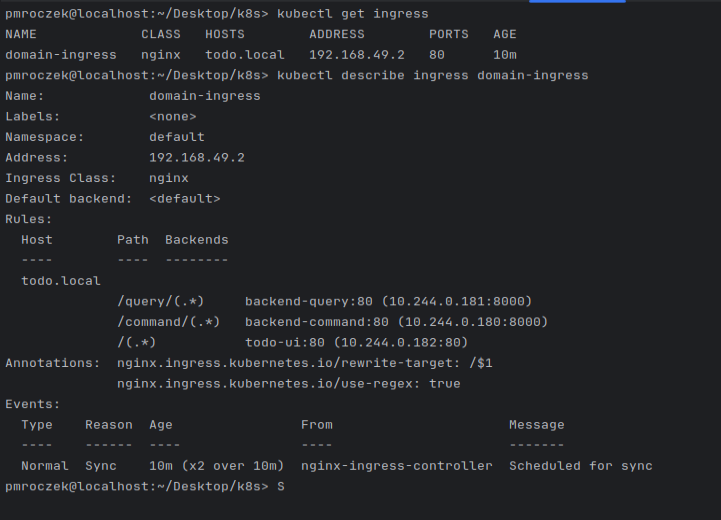

# Event Driven Architecture Todo List

Demo application utilizing Angular, FastAPI, Kafka and PostgreSQL

- As User you can add `Task` todo list
- As User you can remove `Task` from todo list

Data Flow is organized with Kafka message queue system.

## Architecture Overview



## App UI


## Technology Stack

- Angular 18
- FastAPI
- Kafka
- Postgres

## Required setup

Project developed with usage:

- OpenSuse _15.5_
- Minikube _v1.33.1_
- Kubectl _v1.30.1_
- Docker _24.0.7-ce_

### Enable Ingress & Bond domain name with IP Address

Step below install required minikube addons and add ingress to _/etc/hosts_

```bash
minikube addons enable ingress
minikube addons enable ingress-dns

echo "$(minikube ip) todo.local" | sudo tee -a /etc/hosts
```

## How to run

### I.) Dockerhub hosted images

Run K8s setup

```bash
docker pull przemoai/todo-ui:1.0.0
docker pull przemoai/todo-backend-query:1.0.0
docker pull przemoai/todo-backend-command:1.0.0

kubectl apply -f k8s/todo-k8-dockerhub-images.yaml
```
#### Deployments

#### Services

#### Ingress


Clean

```bash 
kubectl delete -f k8s/todo-k8-dockerhub-images.yaml
```

#### II.) Locally built images

This is alternative ways if Dockerhub is not available

1. Collect required docker images

```bash
docker build -t backend-command:1.0.0 -f backend-command/backend-command.Dockerfile .
docker build -t backend-query:1.0.0 -f backend-query/backend-query.Dockerfile .
docker build -t todo-ui:1.0.0 -f todo-ui/todo-ui.Dockerfile .

docker image pull wurstmeister/zookeeper:3.4.6
docker image pull wurstmeister/kafka:2.12-2.5.0
docker image pull postgres:13
```

### [http://Todo.local](http://todo.local)

2. Upload docker images to minikube

```bash
minikube image load backend-command:1.0.0
minikube image load backend-query:1.0.0
minikube image load todo-ui:1.0.0
minikube image load wurstmeister/zookeeper:3.4.6
minikube image load wurstmeister/kafka:2.12-2.5.0
minikube image load postgres
```

3. Run k8s setup

```bash
kubectl apply -f k8s/todo-k8-local-images.yaml
```

4. Clean

```bash
kubectl delete -f k8s/todo-k8-local-images.yaml
```

